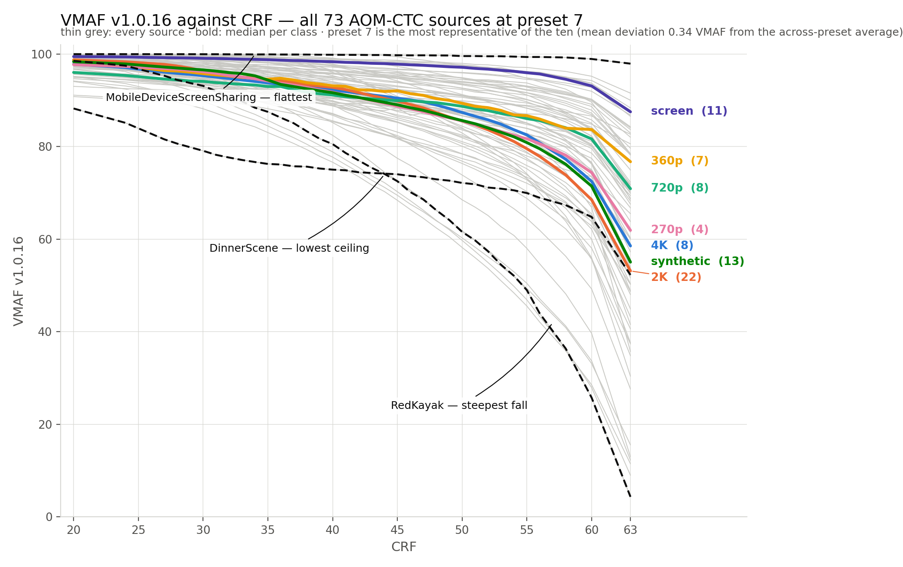

# VMAF Prediction

Predict the VMAF of an SVT-AV1 encode at any CRF and preset from two cheap test encodes ("probes"),
instead of encoding and scoring every setting. Quality is measured with VMAF v1 (`vmaf_v1.0.16_3d0h`).



## Data

73 sources: the pristine SDR video part of the AOM-CTC test set.

| file | rows | contents |
|---|---|---|
| `data/dense_vmaf_73.csv` | 25,550 | every encode: 73 sources x 10 presets (1-10) x 35 CRFs (20-63). `vmaf_v1`, `bitrate_kbps` |
| `data/probe_73.csv` | 146 | the two probes of each source (CRF 20 and 51): bitrate and every metric libvmaf logs |
| `data/good3_73.csv` | 73 | three simple content features (mean and std of luma, temporal information) |

- Encoder: SVT-AV1 v4.0.1, default settings except `--preset` and `--crf`. Scored at full resolution.
- Probe: preset 10 at half resolution (320x180 for the two 480x270 sources), scored with the same VMAF v1 model.
- Probe metrics: besides the score, libvmaf logs 14 metrics, each stored as `_mean`, `_min`, `_max`,
  `_harmonic_mean` over the frames. VMAF v1 uses only 4 of them (`cambi`, `speed_chroma_uv`, `adm3`, `motion3`);
  the other 10 are side outputs. The motion metrics are computed on the source, so they are equal at both probes.
- Checked: 372 randomly chosen encodes were redone from the raw source and matched exactly.
- Per-source curves (73 panels, one line per preset): `figures/vmaf_vs_crf_73_v1.png`.
- Raw videos (~37 GB): `scripts/download_sources.sh <folder>`.

## Method

A tree model (ExtraTrees) predicts VMAF at every CRF and preset from the probe VMAF, probe bitrate and the
probe metrics. It is tested by holding out one source at a time. Two settings:

- **Under the wall**: probes only. Costs about 0.8x one normal encode plus its VMAF scoring.
- **Anchored**: plus one full-resolution encode (preset 8, CRF 40) that corrects the predicted curve. About 2.3x.
- **Anchored at preset 10**: the same encode at preset 10. Cheaper (about 1.9x, estimated) but less accurate.

## Result: are the probe metrics redundant with the probe VMAF?

`notebooks/libvmaf_ablation73.ipynb` (results in `results/`). Mean absolute error in VMAF points:

| model | under the wall | anchored |
|---|---|---|
| probe VMAF + bitrate + GOOD-3 (old method) | 1.735 | 1.072 |
| probe VMAF + bitrate | 2.163 | 1.385 |
| + the 4 metrics VMAF uses | 1.725 | 1.035 |
| + the 10 metrics VMAF does not use | 1.693 | 0.964 |
| **+ all 14 metrics** | **1.681** | **0.959** |
| all 14 metrics, without the probe VMAF | 2.031 | 1.086 |

- The metrics are not redundant with the score: adding them clearly lowers the error. The score is not redundant
  with the metrics either: removing it makes the error clearly worse.
- The redundancy is among the metrics: with the 10 side outputs present, the 4 metrics VMAF uses add little.
- With the anchor, use all 14 metrics. Under the wall, the 4 metrics VMAF uses do as well as all 14.

## Run

```bash
pip install -r requirements.txt
jupyter notebook notebooks/libvmaf_ablation73.ipynb   # about 1 hour on 12 cores
```
